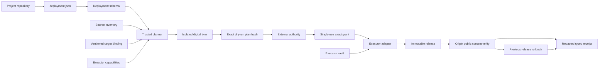
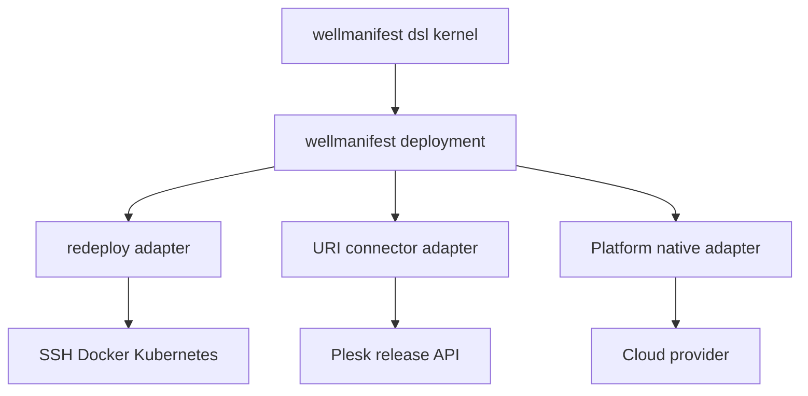

# Deployment DSL architecture

## Scope

`wellmanifest/deployment` owns the neutral deployment-definition contract and
adoption guidance. It does not own inventories, target bindings, Vault,
authorization, execution transports, DNS, or production state.

## Trust boundaries

| Boundary | Owns | Must reject |
| --- | --- | --- |
| Project | Desired deployment policy and logical references | Secret values, raw target coordinates, self-issued grants |
| Inventory | Logical source ref to an exact local/repository artifact | Arbitrary path substituted under a valid ref |
| Binding registry | Atomic environment/provider/target/credential-reference record | Partial target overrides and stale record digest |
| Planner | Deterministic preflight, normalized plan, input/plan hashes | Unevaluable checks and mutation during planning |
| Authority | Fresh, single-use grant for exact plan hash | Changed input, stale form, planner- or LLM-issued authority |
| Executor adapter | Capability implementation, idempotency, release activation | Unknown capability, binding mismatch, plan mutation, secret logging |
| Verifier | Independent origin/public/content evidence | HTTP status as content identity, stale fingerprint |
| Receipt store | Typed result and digest-bound non-secret evidence | Boolean-only success and rewritten failure states |

The dependency direction is one-way. An executor implements the deployment DSL;
the DSL does not import executor-specific fields.

## Canonical and external contracts

The canonical artifact is `schemas/deployment.schema.json`, a closed Draft
2020-12 JSON Schema. The DSL document names, but does not define or carry,
three external runtime artifacts:

1. source inventory record selected by `source.ref`;
2. target binding selected by `target.bindingRef` and exact digest;
3. single-use grant selected by the authority implementation and exact plan
   hash.

They remain separate because configuration, secrets, and authority have
different owners and lifecycles. A portable Git registry may contain a target
binding and opaque credential references. Credential values remain in Vault.

## Safety properties from operational evidence

The architecture directly addresses recurring failure classes:

- Cross-site overwrite is prevented because `/httpdocs` or another
  credential-relative path cannot identify a target by itself. The complete
  binding and digest are verified on both sides of the planner/executor
  boundary.
- Stale approval is prevented because source, binding, strategy, checks,
  capability set, and secret scope contribute to the plan input. Any change
  invalidates dry-run evidence and grant.
- False-positive success is prevented because public reachability and content
  identity are separate checks and `applied_unverified` is a first-class state.
- Unsafe rollback claims are prevented because rollback has its own attempts,
  verification, and failure state. DNS rollback is not silently coupled to
  content rollback.
- Twin refusal is authoritative for preflight: a transport-level success cannot
  override a semantic refusal or `ok=false` result.

## Repository conformance

`dsl-manifest.json` binds every normative artifact by SHA-256 and declares the
single public `DEPLOYMENT` command page. The dependency-free validator from the
pinned `wellmanifest/dsl` revision checks ownership, paths, documentation, and
hashes locally, in CI, and in a networkless runtime container.

