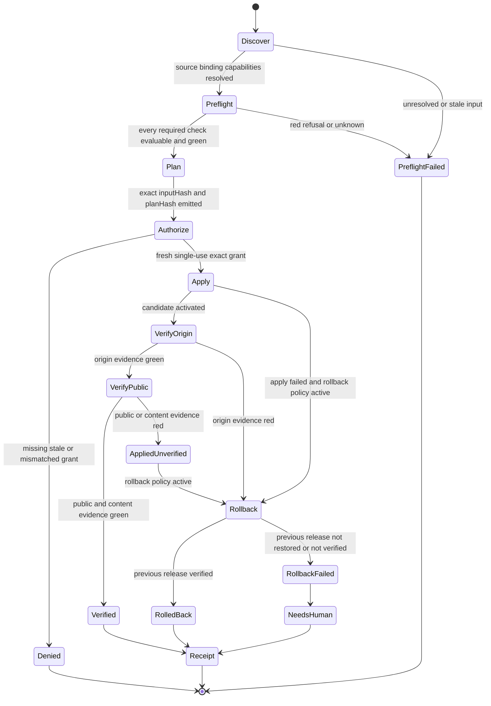
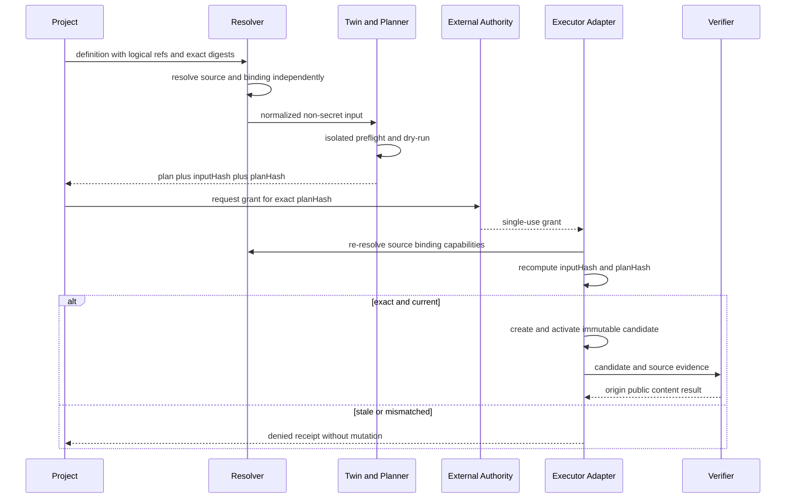
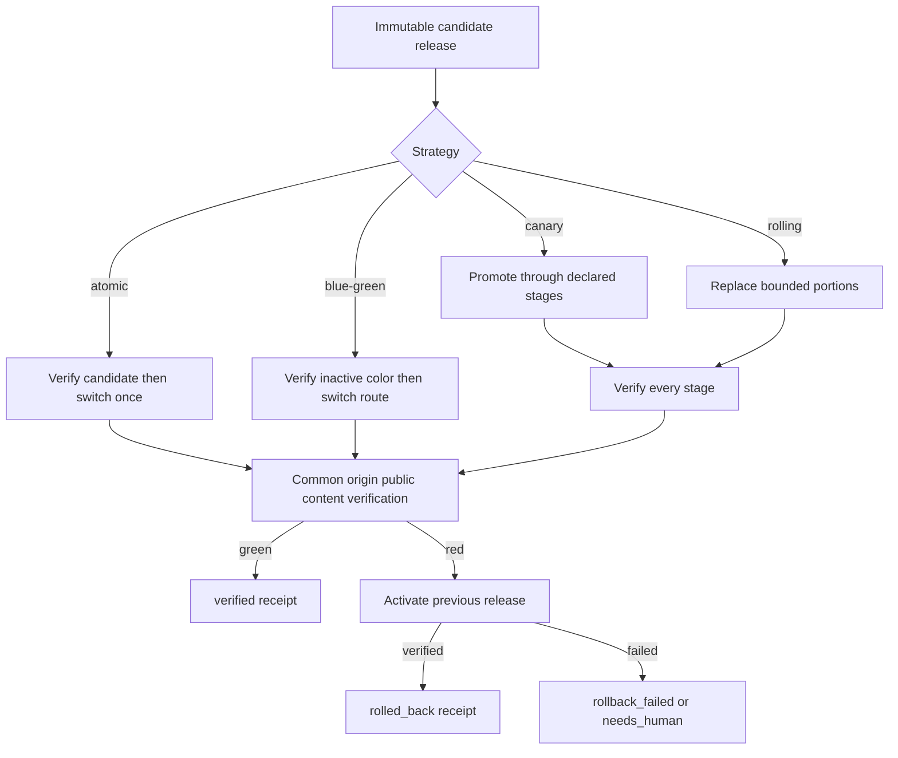
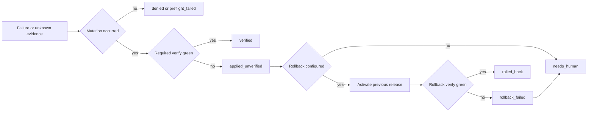

# Deployment DSL logic flow

## Lifecycle

Only `Verified` is successful. `RolledBack` means compensation succeeded, not
that the requested deployment succeeded.

## Exact-plan authorization

An executor that repairs, heals, expands, or otherwise changes the plan must
return to `Plan`. The old grant cannot authorize the new candidate.

## Rollout strategies

### Canary invariants

Canary stages are strictly increasing, unique percentages ending at `100`.
Every stage waits at least `minimumHealthySeconds` and runs its declared checks.
A red or unevaluable stage stops promotion and follows `strategy.onFailure`.

### Verification ladder

1. Confirm the exact source and target-binding digests are still current.
2. Confirm the executor exposes every declared capability.
3. Verify the candidate at the origin without relying on public DNS.
4. Verify the public endpoint, TLS where relevant, and service health.
5. Hash the selected public entrypoint and compare it with the source artifact.
6. Emit `verified` only when every required rung is green.

HTTP 200 can satisfy one health assertion; it cannot satisfy content identity.

## Failure routing

All terminal paths create a redacted receipt bound to the exact input and plan.
No branch silently converts unknown, refusal, compensation, or partial success
into `verified`.
